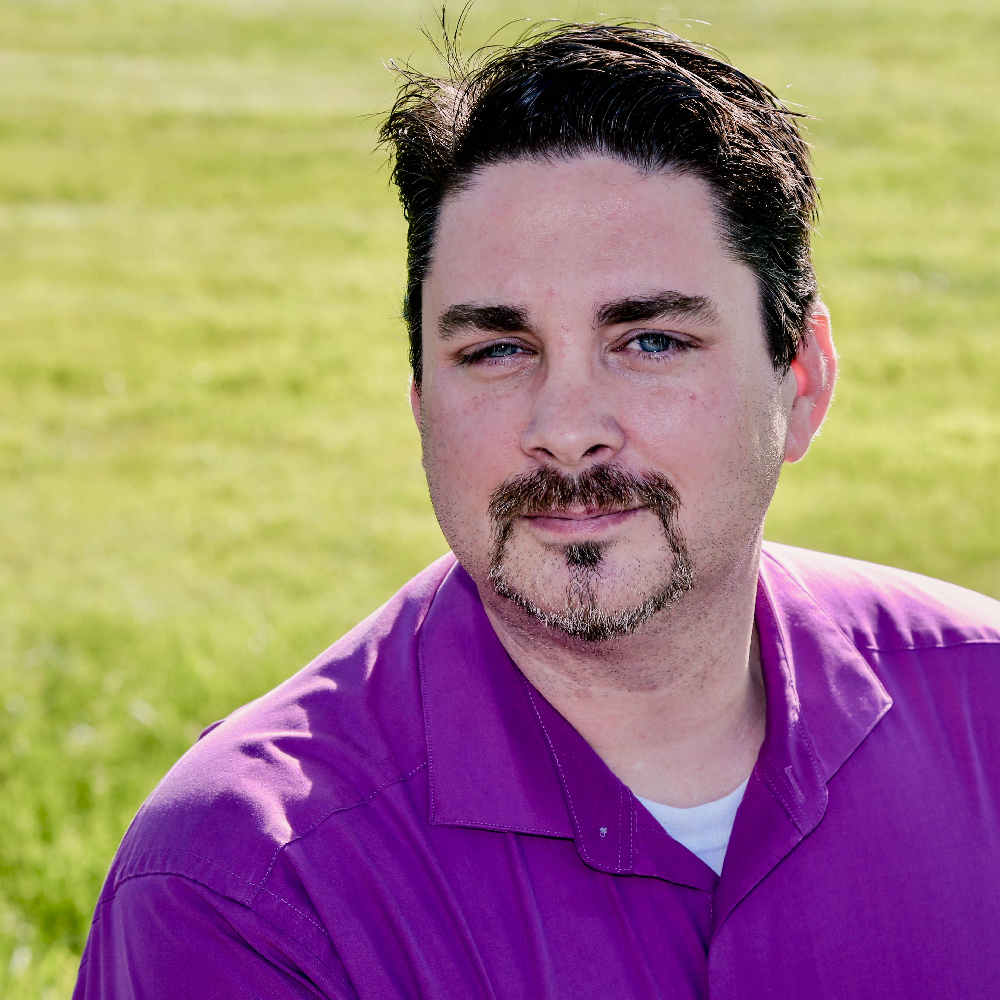

Name: Will Anderson

Occupation: [ Cloud Solutions Architect at Coretek Services ](http://www.coretekservices.com/ "Coretek Services"), [ Chief Executive Officer - The DevOps Collective ](https://devopscollective.org)

Twitter: [@GamerLivingWill](twitter.com/gamerlivingwill)

LinkedIn: [Will Anderson](https://www.linkedin.com/in/gamerlivingwill/)

Website: [www.lastwordinnerd.com](http://www.lastwordinnerd.com)

## Bio:

Will Anderson is a fifteen-year infrastructure veteran with roots in Patch Management, Security, and Compliance. Working in environments ranging from 80 users to over 150,000, Will has acquired a knowledge of a broad range of products and service lines ranging from Exchange, Active Directory and GPO, to the operating system platform and a variety of applications. In recent years he has been focused on delivering cloud solutions and guiding customers into the world of DevOps.

Will has become quite the nerd about PowerShell, and blogs about the latest, new, cool things he finds or creates to make his life as an admin and engineer easier. You can find him on PowerShell.org as a moderator, webmaster, and occasional writer for the PowerShell TechLetter. He is also a founder of the Metro Detroit PowerShell User Group, a member of the Association for Windows PowerShell Professionals, and co-author of Master PowerShell Tricks Volumes 2 and 3.

Will is a fourth-year recipient of the Microsoft MVP award in Cloud and Datacenter Management, and was awarded the moniker of 2015 Honorary Scripting Guy, by Ed Wilson – The Scripting Guy, in January 2016. In October of 2016, he joined the DevOps Collective (501(c)3) Board of Directors.  In 2018, he was named CEO of the DevOps Collective.

## Speaking Sessions

### Managing Managed Images in Azure with Automation and DSC

As more organizations start to walk the path of app modernization,
Infrastructure-as-a-Service in the cloud continues to play a key role.
But how do you balance the requirements of organizational standard built 
imaging requirements with multi-region deployment needs?  Automate it!

In this session, you'll learn how to overcome the limitations of Azure 
Managed images by:
   
   * Leveraging Azure Desired State Configuration to build your organizational image.
   * Automate the creation of the Virtual Machine, application of the configuration, and 
      generalization of the image with Azure Automation runbooks, and
   * Leverage Azure Automation runbooks to build images in any geography, at any time.
### Using Desired State Configuration in Azure

Cloud and Datacenter Management MVP Will Anderson takes you through the
use of Azure’s Desired State Configuration to deliver VM deployment
solutions in the cloud that conform to your organizations’ requirements.
Learn the different methods to deploy your desired state configurations
into the Azure environment to manage both your Service Management and
Resource Manager IaaS deployments.

**Audience:** Intermediate to Advanced  
**Format:** Presentation  
**Time** : 60 minutes

### Conceptualizing Desired State Configuration Using Your Own Scripts

Still trying to get your head around Desired State Configuration? Start
with what you know! Cloud and Datacenter Management MVP Will Anderson
takes you through learning to build DSC configurations using scripts
that you’ve already created. In this mega-session, you’ll learn:

-   Why DSC is important when it comes to auditing, compliance,
    and enforcement.

-   To familiarize yourself with the DSC declarative language format.

-   Create, modify, test, and deploy a DSC configuration.

-   Find and import community sourced resources.

**Audience:** Intermediate to Advanced  
**Format:** Presentation  
**Time** : 90 minutes

### Understanding and Creating Your Own DSC Resources

The community has tons of resources that you can use, but what if you
can’t find the one you need? Build it!

In this session, Cloud and Datacenter Management MVP Will Anderson will
walk you through:

-   Understanding how DSC Resources work behind the scenes when you
    invoke them.

-   Creating your own Desired State Configuration resources using the
    DSC Resource Designer.

**Audience:** Intermediate to Advanced  
**Format:** Presentation  
**Time** : 45-60 minutes

### Conceptualizing Azure Resource Manager Templates

Trying to figure out how to deploy your own custom Azure templates can
be a challenge. In this session, Cloud and Datacenter Management MVP
Will Anderson walks you through:

-   How Azure Resource Manager templates work.

-   Understanding basic JSON logical constructs to give your
    templates flexibility.

-   What tools you can use to assist in validating your construct
    before deployment.

**Audience:** Intermediate to Advanced  
**Format:** Presentation  
**Time** : 120 minutes

### The Challenge of Implementing DevOps In IT

Implementing DevOps can be a risky and difficult task for many IT organizations.  Done correctly, however, it can almost immediately reduce cost and increase productivity in a space known for moving slowly. In this session, Microsoft Cloud and Datacenter Management MVP Will Anderson talks through some of the misconceptions and challenges surrounding DevOps, and how to overcome them.

**Audience:** Executive
**Format:** Presentation
**Time** : 60 minutes
